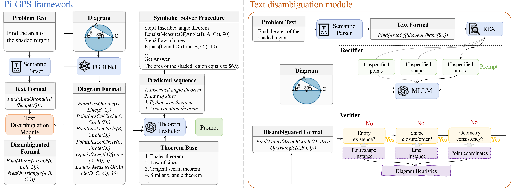

# Pi-GPS

The code for paper "[*Pi-GPS: Enhancing Geometry Problem Solving by Unleashing the Power of Diagrammatic Information*](https://arxiv.org/abs/2503.05543)".

We propose the **Pi-GPS**, a novel framework for geometry problem solving that leverages diagrammatic information to resolve textual ambiguities.
<div align=center>
	
	
</div>
<div align=center>
	Figure 1. Framework of Pi-GPS
</div>

### Key Components

- **Rectifier**:  
  Utilizes multi-modal language models (MLLMs) to disambiguate text by incorporating diagrammatic context.

- **Verifier**:  
  Ensures that the refined text adheres to geometric rules, effectively reducing model hallucinations.

## Performance

Evaluations on benchmarks such as Geometry3K and PGPS9K demonstrate that Pi-GPS outperforms state-of-the-art neural-symbolic methods, achieving nearly a 10% improvement over previous approaches.
<div align="center">
  <table border="1" cellspacing="0" cellpadding="5">
    <thead>
      <tr>
        <th rowspan="2">Category</th>
        <th rowspan="2">Method</th>
        <th colspan="2">Geometry3K</th>
        <th colspan="2">PGPS9K</th>
      </tr>
      <tr>
        <th>Completion</th>
        <th>Choice</th>
        <th>Completion</th>
        <th>Choice</th>
      </tr>
    </thead>
    <tbody>
      <!-- MLLMs -->
      <tr>
        <td rowspan="4">MLLMs</td>
        <td>Qwen-VL</td>
        <td>22.1</td>
        <td>26.7</td>
        <td>20.1</td>
        <td>23.2</td>
      </tr>
      <tr>
        <td>GPT-4o</td>
        <td>34.8</td>
        <td>58.6</td>
        <td>33.3</td>
        <td>51.0</td>
      </tr>
      <tr>
        <td>Claude 3.5 Sonnet</td>
        <td>32.0</td>
        <td>56.4</td>
        <td>27.6</td>
        <td>45.9</td>
      </tr>
      <tr>
        <td>Gemini 2</td>
        <td>38.9</td>
        <td>60.7</td>
        <td>38.2</td>
        <td>56.8</td>
      </tr>
      <!-- Neural Methods -->
      <tr>
        <td rowspan="6">Neural Methods</td>
        <td>NGS</td>
        <td>35.3</td>
        <td>58.8</td>
        <td>34.1</td>
        <td>46.1</td>
      </tr>
      <tr>
        <td>Geoformer</td>
        <td>36.8</td>
        <td>59.3</td>
        <td>35.6</td>
        <td>47.3</td>
      </tr>
      <tr>
        <td>SCA-GPS</td>
        <td>-</td>
        <td>76.7</td>
        <td>-</td>
        <td>-</td>
      </tr>
      <tr>
        <td>GOLD<sup>*</sup></td>
        <td>-</td>
        <td>62.7</td>
        <td>-</td>
        <td>60.6</td>
      </tr>
      <tr>
        <td>PGPSNet-v2-S<sup>*</sup></td>
        <td>65.2</td>
        <td>76.4</td>
        <td>60.3</td>
        <td>69.2</td>
      </tr>
      <tr>
        <td>LANS (Diagram GT)<sup>*</sup></td>
        <td>72.1</td>
        <td>82.3</td>
        <td>66.7</td>
        <td>74.0</td>
      </tr>
      <!-- Neural-symbolic Methods -->
      <tr>
        <td rowspan="4">Neural-symbolic Methods</td>
        <td>Inter-GPS</td>
        <td>43.4</td>
        <td>57.5</td>
        <td>-</td>
        <td>-</td>
      </tr>
      <tr>
        <td>GeoDRL</td>
        <td>57.9</td>
        <td>68.4</td>
        <td>55.6</td>
        <td>66.7</td>
      </tr>
      <tr>
        <td>E-GPS</td>
        <td>-</td>
        <td>67.9</td>
        <td>-</td>
        <td>-</td>
      </tr>
      <tr>
        <td>Pi-GPS (ours)</td>
        <td><b>70.6</b></td>
        <td><b>77.8</b></td>
        <td><b>61.4</b></td>
        <td><b>69.8</b></td>
      </tr>
    </tbody>
  </table>
</div>


## Prepare the Dataset
We use [Geometry3K](https://lupantech.github.io/inter-gps/#Dataset) and [PGPS9K](https://nlpr.ia.ac.cn/databases/CASIA-PGPS9K/) two dataset, Download and Unzip data files into `data/geometry3k` and `data/PGPS9K`

In the Geometry3K dataset, images are stored in separate folders. To streamline processing, we have extracted them into a single unified folder by running:
```
python data/extract.py
```


## Environmental Settings
Python version: **3.9+**
Install all required python dependencies:

```
pip install -r requirement.txt
```


## Run Pi-GPS directly

Run the Pi-GPS with preprocessed data by the following commands to get the final result on Geometry3k dataset:

```shell
python Solver/test.py --label final
```


## Run Pi-GPS from Scratch

### Text Parser

The text parser is a ruled-based semantic parser which convert question text into geometry literals.

```shell
python Parser/text_parser.py
```
The pre-parsed result (text_logic_forms_pred.json) is already in text_parser.

### Diagram Parser

The diagram parser `PGDPNet` (https://github.com/mingliangzhang2018/PGDP) extracts geometry elements and relationships from diagram.You should follow the readme in PGDP to get the diagram parsing result.
The pre-parsed result (PGDP.json) is already in diagram_parser.

### Disambiguation Module
The points recognized by the PGDP model are not displayed on the original image. To better enable the MLLM to understand the image, we first add the points to the original image by running:
```shell
python Disambiguation_module/addPointsToImage.py
```
To run the Disambiguation module, you need to set your MLLM API in the Disambiguation module/align.py first. Different MLLMs may slightly affect the disambiguation results; you can find detailed experiments in the paper.
```shell
python Disambiguation_module/GuidedAlign.py
```
The pre-disambiguated result (disambiguated_text_logic_forms_pred.json) is already in Disambiguation_module.

### Theorem Predictor

To run LLM Theorem Predictor, you should set your reasoning LLM api in Theorem_predictor/LLMPredict.py
```shell
python Theorem_predictor/LLMPredict.py
```

### Solver

Finally, run the symbolic solver over *generated* logic forms:

```shell
python Solver/test.py --label final_result \
--text_logic_form_path Disambiguation_module/disambiguated_text_logic_forms_pred.json \
--diagram_logic_form_path Parser/diagram_parser/PGDP.json \
--predict_path Theorem_predictor/LLM_pred_seq.json
```


## Citation

If the paper or the code helps you, please cite the paper in the following format:
```

```


## Acknowledge
The codes of this project are based on [Inter-GPS](https://github.com/lupantech/InterGPS), [PGDP](https://github.com/mingliangzhang2018/PGDP) and [GeoDRL](https://aclanthology.org/2023.findings-acl.850/). Please let us know if you encounter any issues. You could contact with the first author (zhaojunbo@mail.bnu.edu.cn) or leave an issue in the github repo.
